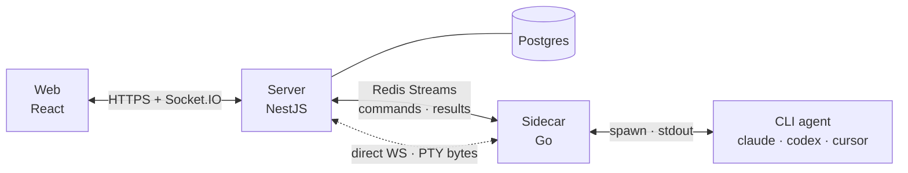

<p align="center">
  
</p>

<h1 align="center">Argus</h1>

A multi-machine **agent management dashboard**. Talk to one or more CLI agents —
Claude Code, Codex, Cursor CLI, or your own — running on any number of machines,
and watch their answers stream back into a single dashboard in real time.



The control plane never speaks to a CLI directly. Every CLI is wrapped by a small
Go **sidecar** that translates its native streaming output into a common
`ResultChunk` format. Commands, lifecycle events and streamed results flow over
**Redis Streams** for durability and replay; interactive **terminal (PTY)**
traffic takes a **direct sidecar↔server WebSocket** so keystroke echo stays
sub-10 ms. The server relays everything to the browser over Socket.IO, giving
token-level streaming with reconnect-safe replay.

## Features

- **Streaming-first UI** — typewriter deltas, tool-call pills, stdout/stderr
  blocks, sticky auto-scroll and replay-on-reconnect. GFM markdown plus LaTeX
  math.
- **Multi-machine by default** — each host runs one `argus-sidecar` daemon that
  self-registers as a *Machine* and starts one runner per installed CLI. No YAML
  to ship to remote boxes.
- **Sessions are conversations** — long-lived threads tied to each CLI's native
  conversation id, pinned to a `(machine, workingDir)` project so you pick up
  where you left off.
- **Auto-discovered adapters** — `claude-code`, `codex` and `cursor-cli` ship in
  the box; the sidecar probes `PATH` at boot and offers only what's installed.
  Adding your own is ~30 lines.
- **Per-session model picker** — model, thinking effort, 1M context and fast
  tier, dispatched as the matching CLI flags per turn.
- **Search that finds answers** — `⌘P` jumps to a session by name; `⌘K` searches
  what was actually *said* across every session, ranked with highlighted
  snippets, and lands you on the matching turn.
- **Live file tree + attachments** — a gitignore-aware tree kept in sync by the
  sidecar's file watcher, with open files re-reading in place as the agent edits
  them. Drag-drop images and files into the composer.
- **Interactive terminal per project (opt-in)** — a real PTY shell, usable for
  full-screen TUIs like `vim` and `htop`. Treat it as remote shell access and
  enable only where every dashboard user is trusted to that level.
- **Usage and quota** — cumulative tokens, a live context-window donut, a
  per-project usage ledger, and how much of each CLI subscription window you've
  burned.
- **Prompt queue and notifications** — keep typing while a turn runs; messages
  queue and dispatch as the session goes idle. Opt-in desktop and iOS alerts when
  something finishes off-screen.

`⌘/` lists every keyboard shortcut. See [`AGENTS.md`](./AGENTS.md) for design
notes and gotchas.

## Repo layout

```
argus/
├── apps/
│   ├── web/                  Vite + React + TS + Tailwind + Zustand
│   ├── server/               NestJS + Prisma + Socket.IO
│   └── ios/                  Native SwiftUI client (see apps/ios/README.md)
├── packages/
│   ├── shared-types/         TS types shared by web + server
│   └── sidecar/              Go sidecar (single binary)
└── deploy/                   docker-compose + Dockerfiles
```

## Prerequisites

- **Node.js** ≥ 20 and **pnpm** ≥ 10 (only to build server/web from source)
- **Go** ≥ 1.23 (only to build the sidecar locally)
- **Docker** + Docker Compose (only for the bundled local stack)
- **Postgres** 16+ and **Redis** 7+ if not using Compose
- A CLI agent on `PATH` for any sidecar you run (`claude`, `codex`, or
  `cursor-agent`)

## Quick start

> Deploying for real rather than trying it out? **[INSTALLATION.md](INSTALLATION.md)**
> is the production guide — managed Postgres/Redis, reverse proxies, Kubernetes
> via Helm, running sidecars under systemd/launchd, updating, and troubleshooting.

### 1. Bring up the stack

```bash
cp .env.example .env
docker compose -f deploy/docker-compose.yml up -d
```

The dashboard is at [http://localhost:5173](http://localhost:5173). Sign in with
the seeded admin credentials (`admin@argus.local` / `changeme` — change them in
`.env`).

This starts Postgres, Redis, MinIO (for attachments), the server and the web app.
The server applies its migrations on boot, so there's no manual migration step.
To pull pre-built images instead of building locally, override `image:` in the
compose file with [`kr4t0n/argus-server`](https://hub.docker.com/r/kr4t0n/argus-server)
and [`kr4t0n/argus-web`](https://hub.docker.com/r/kr4t0n/argus-web).

### 2. Install a sidecar

Run this on whichever machine actually has the CLI you want to expose — that's
why it isn't part of Compose:

```bash
curl -LsSf https://raw.githubusercontent.com/kr4t0n/argus/main/scripts/install.sh | sh
```

Then point it at your server and start it:

```bash
argus-sidecar init      # asks for the bus URL, server URL, and a machine name
argus-sidecar start     # background daemon; `argus-sidecar` runs in the foreground
```

The machine appears at the bottom of the dashboard sidebar. Hover it and click
`+` to create a **project** (a working directory), then `+` on the project to
start a **session**.

For long-lived installs, `argus-sidecar service install` writes and enables a
systemd/launchd unit. See [INSTALLATION.md](INSTALLATION.md) for that, for
pinning versions, and for updating a fleet.

## Environment variables

See [`.env.example`](./.env.example) for the full list, and
[INSTALLATION.md](INSTALLATION.md) for what to set in production. The ones you're
most likely to touch:

| Variable                          | Purpose                                                        |
| --------------------------------- | -------------------------------------------------------------- |
| `DATABASE_URL`                    | Postgres connection string used by Prisma                      |
| `REDIS_URL`                       | Redis connection string used by server **and** sidecars        |
| `JWT_SECRET`                      | HMAC secret for auth tokens                                    |
| `ADMIN_EMAIL` / `ADMIN_PASSWORD`  | Bootstrapped admin credentials                                 |
| `SIDECAR_LINK_TOKEN`              | Shared secret for the terminal's direct sidecar↔server WebSocket |
| `S3_ENDPOINT`                     | S3-compatible endpoint for attachments; **empty = attachments disabled** |

## Adding a custom CLI agent

1. Create `packages/sidecar/internal/adapter/myagent.go`.
2. Implement the `Adapter` interface (usually 20–40 lines — reuse
   `clistream.Start`).
3. Call `adapter.Register("my-agent", &adapter.Plugin{Factory: newMyAgent,
   DefaultBinary: "my-cli"})` from `init()`.
4. Rebuild with `make`.
5. The next boot discovers `my-cli` on `PATH` and offers it in the new-session
   popover.

No server, dashboard or protocol changes are needed — `AgentType` is an open
string and the UI falls back to a generic icon for unknown types.

## Project status

Actively developed. Deploy via Docker Compose or the Helm chart; a native
SwiftUI iOS/iPadOS client is in progress (see
[`apps/ios/README.md`](apps/ios/README.md)). Single-tenant admin auth today, with
RBAC and OpenTelemetry still deferred. Design notes, gotchas and known
follow-ups live in [`AGENTS.md`](./AGENTS.md).
